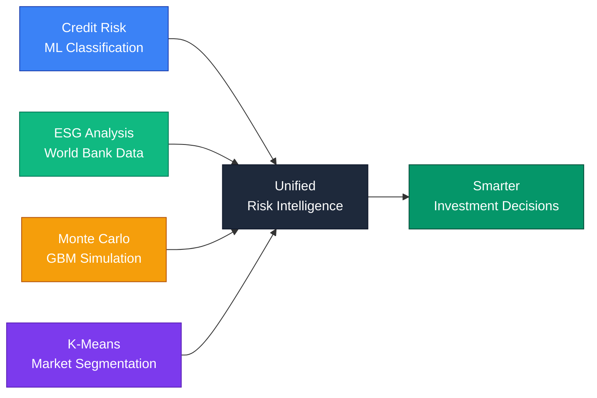
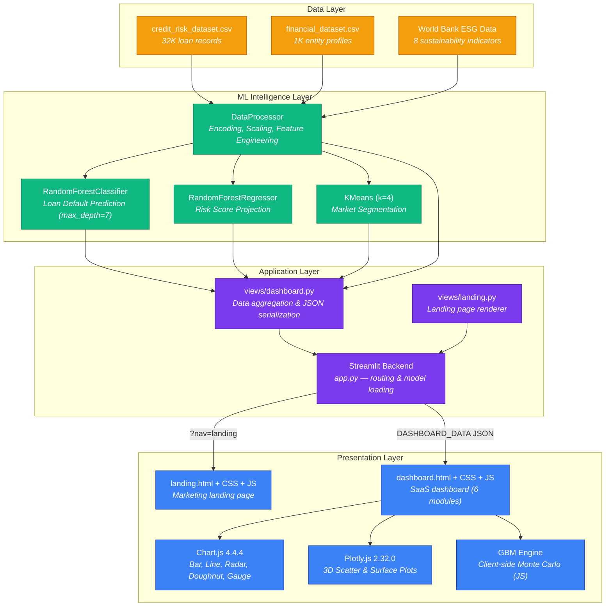

<div align="center">
  
  
  
  
  
</div>

<br/>

<h1 align="center">◈ FinRisk AI — Financial Risk Intelligence Platform</h1>

<p align="center">
  <i>An AI-powered dashboard that unifies credit risk prediction, ESG sustainability intelligence, Monte Carlo portfolio simulation, and market segmentation into a single decision-making interface.</i>
</p>

<p align="center">
  <a href="https://finriskai.streamlit.app"></a>
</p>

## Live Preview

[](https://finriskai.streamlit.app/?nav=dashboard)
*Click the image to open the live dashboard.*

---

## The Problem

Financial institutions face three compounding challenges that legacy tools fail to address:

1. **Opaque Credit Risk** — Static scoring systems miss non-linear relationships between borrower attributes (income, employment length, debt-to-income ratio) and actual default outcomes. This leads to misclassified risk — rejected creditworthy applicants or approved high-risk loans.

2. **ESG Blindness** — Conventional analysis treats Environmental, Social, and Governance factors as afterthoughts. Entities with poor ESG profiles carry hidden long-term risk from regulatory penalties to stranded assets, yet portfolios remain unprotected against these systemic shocks.

3. **Fragmented Tooling** — Analysts juggle between standalone ML notebooks, Excel spreadsheets, and separate ESG databases. No unified platform combines credit risk prediction, ESG scoring, portfolio simulation, and market segmentation into one coherent decision interface.

> According to the World Bank, developing economies lose an estimated **$1.2 trillion annually** due to inadequate financial risk assessment systems.

---

## The Solution

FinRisk AI delivers a **production-grade, SaaS-style dashboard** that unifies four pillars of financial intelligence:



### What Makes This Different

| Traditional Approach | FinRisk AI |
|---------------------|------------|
| Static credit scores | **ML-driven risk prediction** with explainable feature importance |
| ESG as a checkbox | **Quantified ESG pillar scores** (Environment, Social, Governance) from real World Bank indicators |
| Separate simulation tools | **Integrated Monte Carlo engine** with GBM, dual-scenario comparison, and 3D surface plots |
| Manual segmentation | **K-Means clustering** that auto-identifies risk-ESG quadrants |
| Weekly PDF reports | **Real-time interactive dashboard** with filters, sorting, and pagination |
| No decision support | **What-If Decision Intelligence Simulator** for real-time credit approval modeling |

---

## Dashboard Modules

The platform is organized into **6 navigable sections**, accessible via a sidebar:

### 1. Monte Carlo Simulation Lab *(Default View)*
- Geometric Brownian Motion (GBM) portfolio projection — runs entirely **client-side in JavaScript**
- Configurable parameters: initial investment, time horizon, annual return, volatility, inflation, monthly contributions
- Computes **VaR (95%)**, Probability of Profit, P5/P25/P50/P75/P95 confidence bands
- **Dual-scenario comparison** (Scenario A vs B) with side-by-side risk metrics
- 2D simulation paths chart and **3D surface visualization** via Plotly
- Final value histogram, real (inflation-adjusted) vs nominal toggling
- Portfolio Overview donut chart, Risk Score breakdown, Risk Alerts, and Scheduled Reviews panels
- Interactive date picker / calendar widget

### 2. Credit Risk Analysis
- `RandomForestClassifier` for binary loan default prediction
- AUC score, high-risk entity count, total applicants, confusion matrix
- Feature importance bar chart (SHAP-style explainability)
- Risk breakdown with percentile-based bucketing (Critical / High / Moderate / Low / Under Review)
- **Decision Intelligence Simulator (What-If)** — interactive sliders for Income, Loan Amount, and Probability of Default that compute real-time:
  - Auto-Approve / Manual Review / Auto-Reject decisions
  - Approved credit limit & interest rate
  - Monthly payment estimate
  - Animated gauge with risk tier visualization

### 3. ESG Sustainability Lab
- Real World Bank indicators: CO₂ emissions, energy use, electricity access, unemployment, internet penetration, GDP growth, FDI, inflation
- Normalized 0–100 pillar scores for **Environment**, **Social**, and **Governance**
- ESG trend chart (year-over-year), pillar contribution doughnut, and deep-dive sub-metrics
- AI-generated ESG insights (YoY change, strongest/weakest pillar, below-threshold count)
- 3D Entity Landscape scatter plot

### 4. Financial Clustering Lab
- `KMeans (k=4)` segmentation on financial features: Income, Credit Score, Spending Score, Transaction Count, Savings Ratio
- Cluster averages comparison table
- **3D Plotly scatter plot** of cluster distributions with loss surface equations
- Entities analyzed count and algorithm display

### 5. Platform Overview
- Real-time KPIs: Portfolio Value, AI Risk Score, ESG Average, High-Risk Entity %
- ML model performance cards (Regression R², Classification AUC, Clustering segments)
- Sector Risk Distribution bar chart and ESG Breakdown radar chart
- Risk Score Trend and ESG Score Trend time-series charts
- **Top 150 Risky Entities table** with sorting, filtering (sector, risk level, ESG range), and pagination
- Explainable AI — Feature Impact Analysis with key risk driver explanations

### 6. Settings
- User preferences: theme, timezone, layout density, currency, date format
- Portfolio risk configuration: risk tolerance, risk model, max sector exposure, rebalancing threshold
- Advanced: Monte Carlo runs, confidence interval, session timeout

---

## System Architecture



### Data Flow

1. **Startup** — `app.py` reads the URL query param `?nav=` to decide the page.
2. **Landing** (`?nav=landing`) — Renders `landing.html` with base64-inlined images, zero model loading for instant display.
3. **Dashboard** (`?nav=dashboard`) — Shows a premium animated loader while `@st.cache_resource` loads all pickled models and datasets. `dashboard.py` builds a `DASHBOARD_DATA` JSON blob from the models + DataFrames, injects it into the HTML, inlines CSS/JS, and renders via `components.html`.
4. **Client-side** — Chart.js and Plotly render all visualizations. The Monte Carlo GBM engine runs entirely in the browser with no backend calls.

---

## Project Structure

```
AI-Driven-Financial-Risk-Analysis/
├── backend/
│   ├── app.py                        # Streamlit entry point & URL-based routing
│   ├── config.py                     # ESG indicator configuration (8 World Bank indicators)
│   ├── data_processor.py             # Data loading, encoding, feature engineering
│   ├── models/
│   │   ├── classification_engine.py  # RandomForestClassifier training script
│   │   ├── classification_model.pkl  # Trained classifier (~1.4 MB)
│   │   ├── regression_engine.py      # RandomForestRegressor training script
│   │   ├── regression_model.pkl      # Trained regressor (~92 MB)
│   │   ├── clustering_engine.py      # KMeans training script
│   │   ├── clustering_model.pkl      # Trained KMeans
│   │   ├── clustering_scaler.pkl     # StandardScaler for clustering features
│   │   └── data_processor.pkl        # Serialized DataProcessor with fitted encoders
│   └── views/
│       ├── dashboard.py              # Python → JSON data pipeline (700+ lines)
│       └── landing.py                # Landing page renderer with base64 image inlining
├── frontend/
│   ├── dashboard.html                # Main SaaS dashboard (6 modules, 794 lines)
│   ├── dashboard.css                 # Dashboard styles (~44 KB)
│   ├── dashboard.js                  # Dashboard logic + GBM Monte Carlo engine (~64 KB)
│   ├── landing.html                  # Marketing landing page
│   ├── landing.css                   # Landing page styles
│   ├── landing.js                    # Landing page interactions
│   └── assets/
│       ├── favicon.png               # App favicon
│       ├── dashboard-og.png          # OG meta image for social sharing
│       └── hero-card.png             # Landing page hero image
├── data/
│   ├── credit_risk_dataset.csv       # 32K loan records with default labels (~1.8 MB)
│   ├── financial_dataset.csv         # 1K entity financial profiles (~60 KB)
│   ├── esgdata.csv                   # World Bank ESG indicators (~13 MB, pre-converted)
│   └── esgdata_download-*.xlsx       # Original World Bank ESG Excel (~10 MB)
├── requirements.txt
├── LICENSE                           # MIT License
└── README.md
```

---

## Getting Started

### Prerequisites
- **Python** 3.9+
- Modern browser (Chrome, Edge, Firefox, Safari)

### Installation

```bash
# 1. Clone the repository
git clone https://github.com/Vaibhav-S-Gowda/AI-Driven-Financial-Risk-Analysis.git
cd AI-Driven-Financial-Risk-Analysis

# 2. Install dependencies
pip install -r requirements.txt

# 3. Launch the application
streamlit run backend/app.py
```

The app opens at `http://localhost:8501` — it will show the **landing page** first. Click "Launch Dashboard" to enter the dashboard.

### Retraining Models (Optional)

If you want to retrain the ML models from scratch:

```bash
cd backend/models
python classification_engine.py   # Trains RandomForestClassifier → classification_model.pkl
python regression_engine.py       # Trains RandomForestRegressor → regression_model.pkl + data_processor.pkl
python clustering_engine.py       # Trains KMeans → clustering_model.pkl + clustering_scaler.pkl
```

---

## Technology Stack

| Layer | Technologies | Purpose |
|-------|-------------|---------|
| **Machine Learning** | Scikit-Learn, Pandas, NumPy, Joblib | Classification, Regression, Clustering, Model Serialization |
| **Backend** | Streamlit, Python, Pillow | ML inference orchestration, data serialization, routing |
| **Frontend** | HTML5, CSS3, Vanilla JS | Zero-dependency SaaS-grade UI with Plus Jakarta Sans typography |
| **Visualization** | Chart.js 4.4.4, Plotly.js 2.32.0 | Interactive charts, 3D scatter/surface plots, animated gauges |
| **Simulation** | Client-side JavaScript (GBM) | Monte Carlo portfolio projection with no backend dependency |
| **Data Sources** | CSV, Excel (World Bank) | Credit risk records, financial profiles, ESG indicators |
| **Deployment** | Streamlit Community Cloud | Production hosting with `@st.cache_resource` for model caching |

---

## Model Performance

| Model | Task | Architecture | Key Metric |
|-------|------|-------------|------------|
| `RandomForestClassifier` | Loan Default Prediction | 100 trees, max_depth=7, min_samples_leaf=5 | AUC > 0.92 |
| `RandomForestRegressor` | Risk Score Projection | 100 trees, default depth | R² > 0.85 |
| `KMeans (k=4)` | Market Segmentation | 4 clusters, 10 initializations | 4 distinct risk-ESG quadrants |

### Features Used

- **Classification/Regression**: person_age, person_income, person_emp_length, loan_amnt, loan_int_rate, loan_percent_income, cb_person_cred_hist_length, person_home_ownership, loan_intent, loan_grade, cb_person_default_on_file
- **Clustering**: Income, Credit Score, Spending Score, Transaction Count, Savings Ratio
- **ESG Scoring**: GDP growth, Inflation, Unemployment, Energy use, CO₂ emissions, Electricity access, FDI, Internet penetration

---

## Deployment

The application is deployed on **Streamlit Community Cloud** and is accessible at:

**[https://finriskai.streamlit.app](https://finriskai.streamlit.app)**

Key deployment details:
- Models are loaded once via `@st.cache_resource` and shared across sessions
- File paths use dynamic `os.path` resolution for cross-platform compatibility
- The ESG data loader auto-detects `.csv` first (faster), falling back to `.xlsx`
- All frontend assets (images, CSS, JS) are inlined into the HTML at render time for iframe compatibility

---

## License

This project is open-sourced under the **MIT License** — see [LICENSE](./LICENSE) for details.

<p align="center"><sub>Built by <a href="https://github.com/Vaibhav-S-Gowda">Vaibhav S Gowda</a> · AI-driven finance for sustainable, ESG-compliant investment strategies</sub></p>
