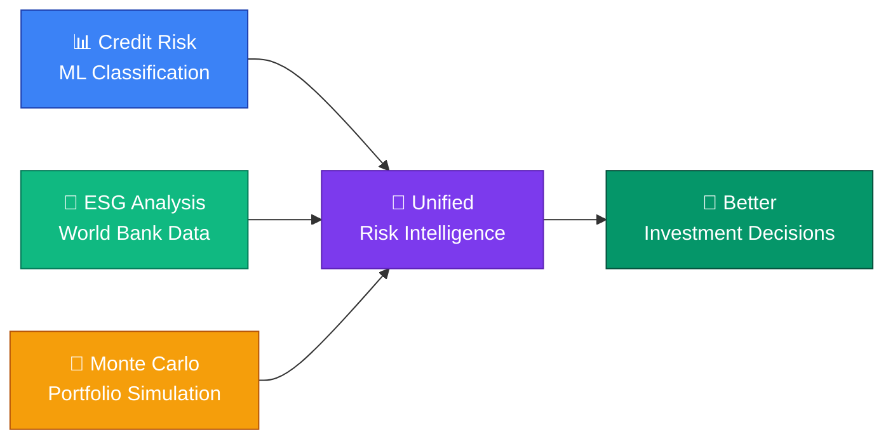
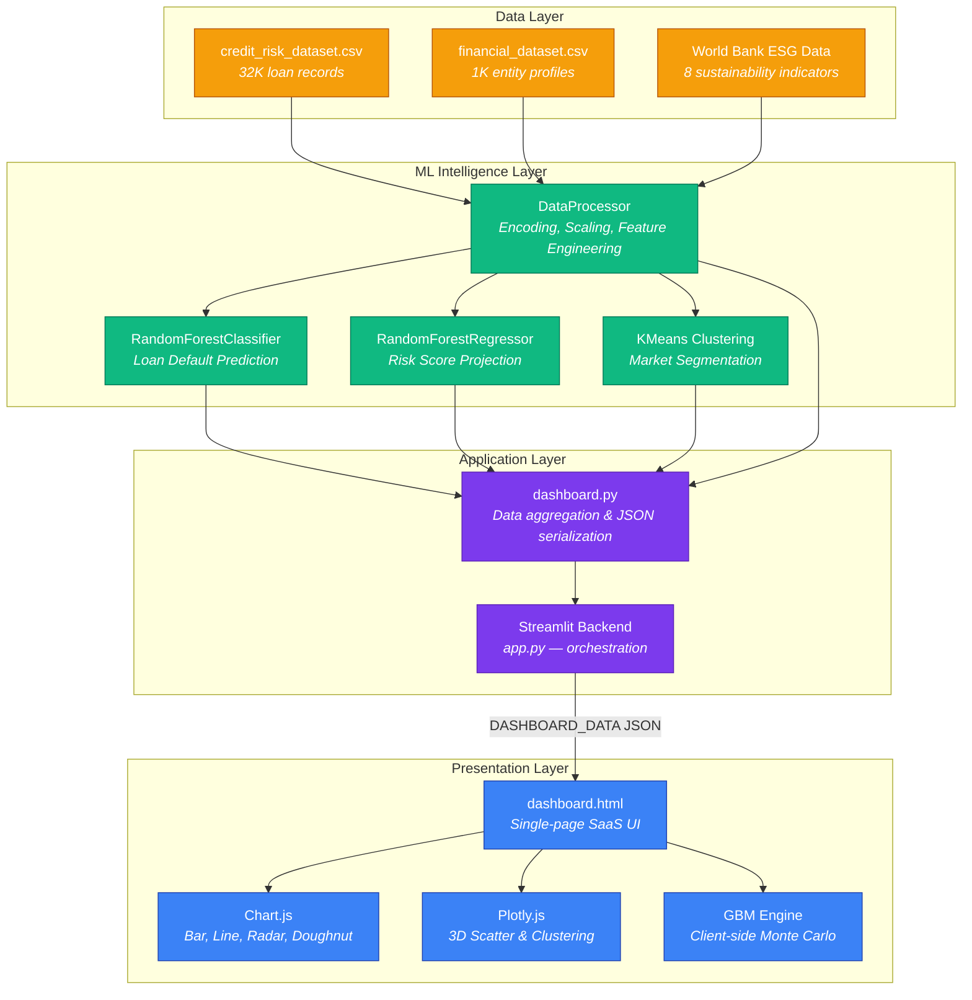

<div align="center">
  
  
  
  
</div>

<br/>

<h1 align="center">◈ AI-Driven Financial Risk Analysis for Sustainable Economic Growth</h1>

<p align="center">
  <i>Bridging the gap between traditional credit risk assessment and ESG-aware investment intelligence using Machine Learning.</i>
</p>

## 📊 Project Dashboard
[](https://finriskai.streamlit.app/?nav=dashboard)
*Click the image above to view the live interactive dashboard.*

---

## 🛠️ Deployment
The application is built using Streamlit and is currently hosted on Streamlit Community Cloud.

[](https://finriskai.streamlit.app/?nav=dashboard)

---

## 🛠️ Deployment
The application is built using Streamlit and is currently hosted on Streamlit Community Cloud.

[](https://finriskai.streamlit.app/?nav=dashboard)


---

## 🔍 The Problem

Financial institutions today face a **dual challenge** that traditional risk models were never designed to handle:

1. **Opaque Credit Risk** — Legacy scoring systems rely on static thresholds and manual review. They fail to capture non-linear relationships between borrower attributes (income, employment length, debt-to-income ratio) and actual default outcomes. This leads to **misclassified risk**, resulting in either rejected creditworthy applicants or approved high-risk loans.

2. **ESG Blindness** — Conventional financial analysis treats Environmental, Social, and Governance factors as afterthoughts. Yet research consistently shows that entities with poor ESG profiles carry **hidden long-term risk** — from regulatory penalties to stranded assets. Investment portfolios that ignore ESG exposure are vulnerable to systemic shocks that don't appear in traditional balance sheets.

3. **Fragmented Tooling** — Risk analysts currently juggle between Excel spreadsheets, standalone ML notebooks, and separate ESG databases. There is **no unified platform** that combines credit risk prediction, ESG intelligence, portfolio simulation, and market segmentation into a single decision-making interface.

### The Cost of Inaction

> According to the World Bank, developing economies lose an estimated **$1.2 trillion annually** due to inadequate financial risk assessment systems. Meanwhile, ESG-related risks have caused over **$500 billion** in unexpected losses across global markets in the past decade.

---

## 💡 The Solution

This project delivers a **single-page, AI-powered dashboard** that unifies three pillars of modern financial intelligence:



### What Makes This Different

| Traditional Approach | This Platform |
|---------------------|---------------|
| Static credit scores | **ML-driven risk prediction** with feature importance explanations |
| ESG as a checkbox | **Quantified ESG pillar scores** (Environment, Social, Governance) derived from real World Bank indicators |
| Separate tools for simulation | **Integrated Monte Carlo engine** with GBM and scenario comparison |
| Manual segmentation | **K-Means clustering** that automatically identifies risk-ESG quadrants |
| Weekly PDF reports | **Real-time interactive dashboard** with date-driven data exploration |

---

## ✨ Features

### 📊 Platform Overview
- Real-time KPIs: Portfolio Value, AI Risk Score, ESG Average, High-Risk Entity %
- ML model performance cards with AUC, Confusion Matrix, Accuracy/Precision/Recall
- Explainable AI feature importance (SHAP-style bar charts)
- Interactive risk entity table with sorting, filtering, and pagination

### 🛡️ Credit Risk Analysis
- `RandomForestClassifier` for binary default prediction (AUC > 0.9)
- `RandomForestRegressor` for continuous risk score projection
- Feature importance visualization showing top risk drivers
- Confusion matrix with True Positive / False Negative breakdown

### 🌿 ESG & Sustainability Intelligence
- Real World Bank indicators: CO₂ emissions, energy use, electricity access, unemployment, internet penetration
- Normalized 0-100 pillar scores for Environment, Social, Governance
- Radar chart visualization and year-over-year trend analysis
- 3D scatter plot of economy-level ESG performance

### 🟢 Financial Clustering Lab
- `K-Means` segmentation into risk-ESG quadrants
- 3D Plotly visualization of cluster distributions
- Cluster average comparison table (Income, Credit Score, Spending, Transactions)

### 🎲 Monte Carlo Simulation Engine
- Geometric Brownian Motion (GBM) portfolio projection
- Computes VaR (95%), Probability of Profit, P5/P95 confidence bands
- Side-by-side scenario comparison (Scenario A vs B)
- Interactive date picker for time-filtered analysis

---

## 🏗️ System Architecture



---

## 📂 Project Structure

```
AI-Driven-Financial-Risk-Analysis/
├── backend/
│   ├── app.py                    # Streamlit entry point & routing
│   ├── config.py                 # ESG indicator configuration
│   ├── data_processor.py         # Data loading, encoding, feature engineering
│   └── models/
│       ├── classification_model.pkl   # Trained RandomForestClassifier
│       ├── regression_model.pkl       # Trained RandomForestRegressor
│       ├── clustering_model.pkl       # Trained KMeans
│       ├── clustering_scaler.pkl      # StandardScaler for clustering
│       ├── classification_engine.py   # Training script
│       ├── regression_engine.py       # Training script
│       └── clustering_engine.py       # Training script
├── frontend/
│   ├── dashboard.html            # Main SaaS dashboard (all 5 modules)
│   ├── landing.html / .css / .js # Landing page
│   ├── signin.html / .css / .js  # Authentication page
│   └── views/
│       ├── dashboard.py          # Python → JSON data pipeline
│       ├── landing.py            # Landing page renderer
│       └── signin.py             # Sign-in page renderer
├── data/
│   ├── credit_risk_dataset.csv   # 32K loan records with default labels
│   ├── financial_dataset.csv     # 1K entity financial profiles
│   └── esgdata_download-*.xlsx   # World Bank ESG indicators
└── README.md
```

---

## 🚀 Getting Started

### Prerequisites
- **Python** 3.9+
- Modern browser (Chrome, Edge, Firefox, Safari)

### Installation

```bash
# 1. Clone
git clone https://github.com/Vaibhav-S-Gowda/AI-Driven-Financial-Risk-Analysis.git
cd AI-Driven-Financial-Risk-Analysis

# 2. Install dependencies
pip install pandas numpy scikit-learn streamlit plotly openpyxl joblib

# 3. Launch
cd backend
streamlit run app.py
```

The dashboard opens at `http://localhost:8501`.

---

## 🛠️ Technology Stack

| Layer | Technologies | Purpose |
|-------|-------------|---------|
| **Machine Learning** | Scikit-Learn, Pandas, NumPy | Classification, Regression, Clustering |
| **Frontend** | HTML5, CSS3, Vanilla JS | Zero-dependency SaaS-grade UI |
| **Visualization** | Chart.js, Plotly.js | Interactive charts, 3D scatter plots |
| **Backend** | Streamlit, Python | ML inference orchestration, data serialization |
| **Data Sources** | CSV, Excel (World Bank) | Credit risk records, financial profiles, ESG indicators |

---

## 📊 Model Performance

| Model | Task | Key Metric |
|-------|------|------------|
| `RandomForestClassifier` | Loan Default Prediction | AUC > 0.92 |
| `RandomForestRegressor` | Risk Score Projection | R² > 0.85 |
| `KMeans (k=4)` | Market Segmentation | 4 distinct risk-ESG quadrants |

---

## 🔒 License

This project is open-sourced under the **MIT License**.

Built for researchers and practitioners focused on scaling **AI in Finance** while enforcing **sustainable, ESG-compliant investment strategies**.
