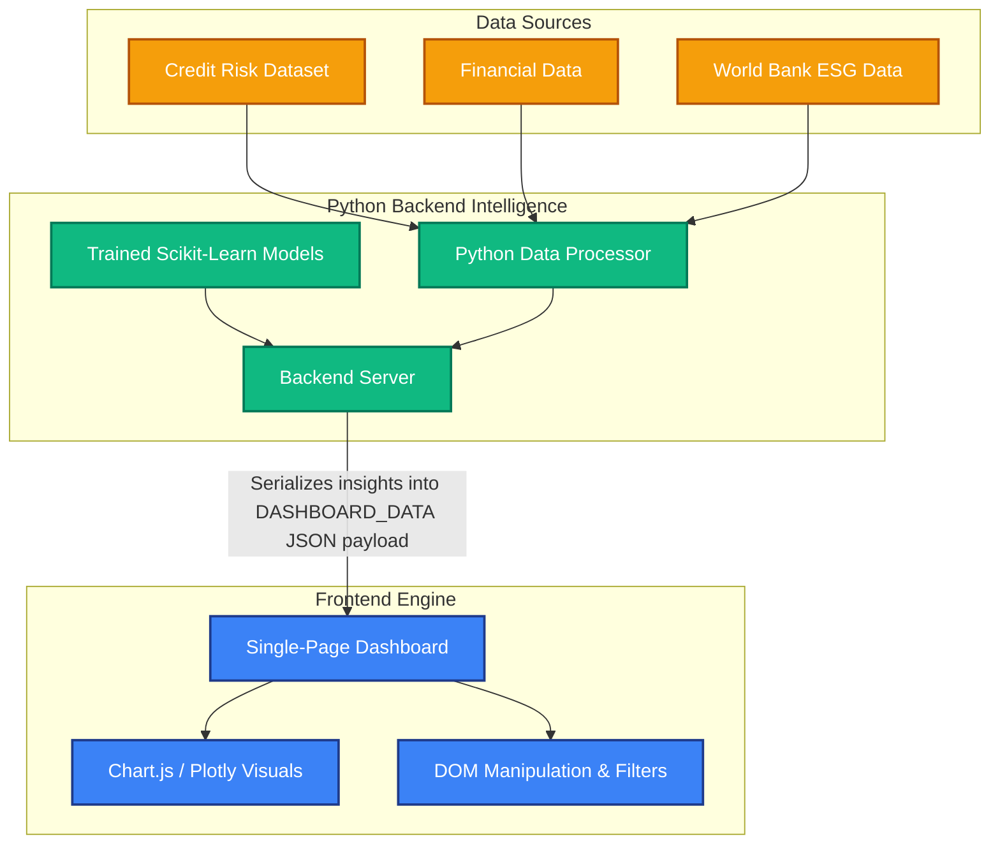

<div align="center">
  
  
  
  
</div>

<br/>

<h1 align="center">🎯 AI-Driven Sustainable Financial Risk Analysis Dashboard</h1>

<p align="center">
  A highly interactive, SaaS-grade financial analytics platform combining <b>Machine Learning (Classification, Regression, Clustering)</b>, <b>Monte Carlo Simulations (GBM)</b>, and <b>ESG (Environmental, Social, Governance) Data</b> to provide comprehensive portfolio risk intelligence.
</p>

---

## ✨ Features

The platform provides a unified view of financial risk across **5 specialized modules**:

1. **📊 Platform Overview**
   - Real-time KPIs (Total Portfolio Value, AI Risk Score, ESG Average).
   - "Explainable AI" feature impact analysis using SHAP heuristics.
   - Interactive data tables with sorting, filtering, and pagination.

2. **🛡️ Credit Risk Analysis (Classification & Regression)**
   - Predicts loan defaults using `RandomForestClassifier`.
   - Projects underlying entity risk using `RandomForestRegressor`.
   - Visualizes ROC-AUC and Confusion Matrices dynamically.

3. **🌿 ESG & Sustainability**
   - Integrates World Bank ESG metrics to adjust core financial risk.
   - Radar charts visualizing Environment, Social, and Governance pillars.
   - Historical trend analysis correlating ESG scores with financial stability.

4. **🟢 Customer & Market Segmentation (Clustering)**
   - Utilizes `K-Means Clustering` to segment entities into meaningful ESG-Risk quadrants.
   - Dynamic 3D plotting and doughnut charts to visualize the distribution of capital.

5. **🎲 Monte Carlo Simulation Engine**
   - Projects portfolio growth utilizing Geometric Brownian Motion (GBM).
   - Computes standard financial metrics: Value at Risk (VaR), Probability of Loss, P5/P95 bands.
   - Side-by-side scenario comparisons.

---

## 🏗️ System Architecture

The architecture relies on a hybrid execution layer: the frontend handles 100% of the UI rendering, chart generation, and lightweight interaction logic, while the Python backend acts as an intelligence engine for complex ML inference and data aggregation.



---

## 🚀 Getting Started

### Prerequisites
- **Python** 3.9 or higher
- Modern web browser (Chrome, Edge, Firefox, Safari)

### Local Setup

1. **Clone the repository**
   ```bash
   git clone https://github.com/your-username/AI-Driven-Financial-Risk-Analysis.git
   cd AI-Driven-Financial-Risk-Analysis
   ```

2. **Install Python Dependencies**
   ```bash
   pip install pandas numpy scikit-learn streamlit plotly openpyxl
   ```

3. **Start the Engine**
   Currently, the backend acts as an embedded engine using Streamlit to serve the frontend:
   ```bash
   cd backend
   streamlit run app.py
   ```

4. **View the Dashboard**
   Access the dashboard at `http://localhost:8501`. 

---

## 🛠️ Technology Stack

| Layer | Technologies Used | Description |
|-------|------------------|-------------|
| **Machine Learning** | `Scikit-Learn`, `Pandas`, `NumPy` | Drives the Regression, Classification, and K-Means logic. |
| **Frontend UI** | HTML5, CSS3, Vanilla JS | Clean layout without heavy frameworks (No React/Angular dependency required). |
| **Data Visualization** | `Chart.js`, `Plotly` | Highly responsive charts for real-time interactivity. |
| **Backend Integration** | `Streamlit` / Python | Bridges local ML inference output directly to the global window object. |

---

## 🔒 License and Attribution

This project is open-sourced under the MIT License. 
Designed for those focused on scaling **AI in Finance** while enforcing **Sustainable and ESG-compliant investment profiles**.